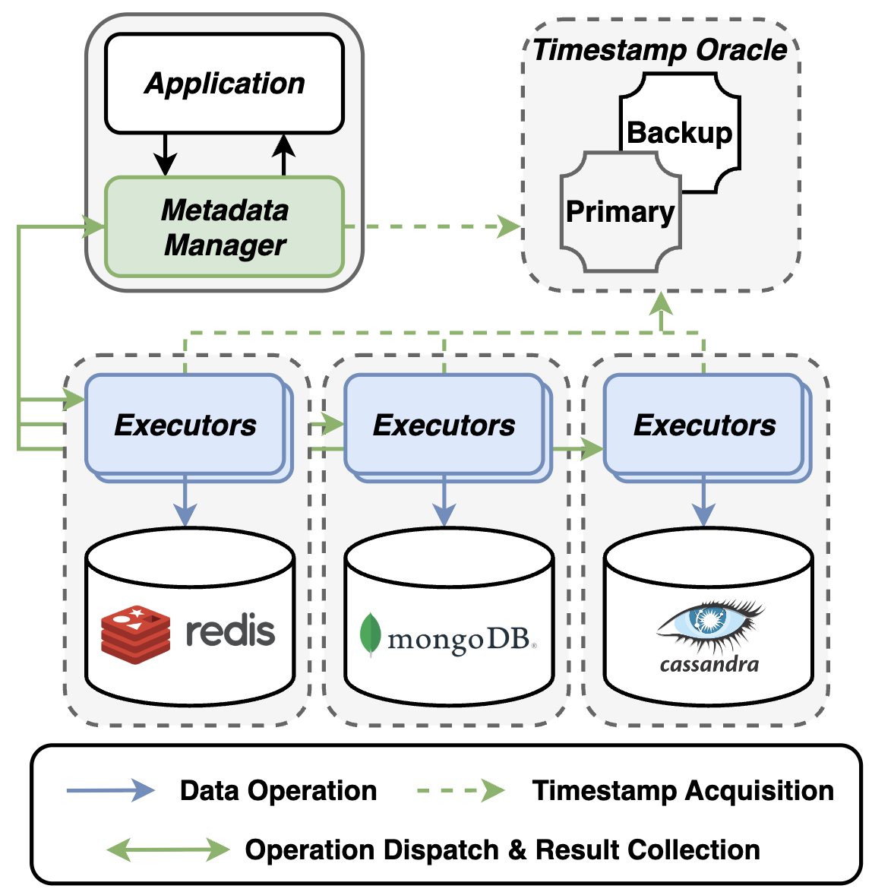

# Oreo: A High-Performance and Scalable Transactions Framework across Heterogeneous NoSQL Data Stores

[](https://goreportcard.com/report/github.com/oreo-framework/oreo)
[](https://pkg.go.dev/github.com/oreo-framework/oreo)
[](https://opensource.org/licenses/MIT)

This repository is dedicated to sharing the implementation of Oreo for the EuroSys 2026 paper entitled: Oreo: A High-Performance and Scalable Transactions Framework across Heterogeneous NoSQL Data Stores.

<div align="center">


</div>

## Table of Contents

- [Oreo: A High-Performance and Scalable Transactions Framework across Heterogeneous NoSQL Data Stores](#oreo-a-high-performance-and-scalable-transactions-framework-across-heterogeneous-nosql-data-stores)
  - [Table of Contents](#table-of-contents)
  - [Oreo Structure](#oreo-structure)
  - [Project Structure](#project-structure)
  - [Evaluation](#evaluation)
    - [Topology](#topology)
    - [Environment Setup](#environment-setup)
    - [Run Evaluation](#run-evaluation)
      - [YCSB](#ycsb)
      - [Realistic Workloads](#realistic-workloads)
        - [IOT](#iot)
        - [Social](#social)
        - [Order](#order)
      - [Optimization](#optimization)
      - [Read Strategy](#read-strategy)
      - [FT](#ft)
      - [Scalability](#scalability)
  - [License](#license)

## Oreo Structure



## Project Structure

- `./benchmarks`: All code related to benchmark testing
- `./bin-util`: Utility executables
- `./executor`: Code for the Stateless Executor
- `./ft-executor`: Code for the Fault-Tolerant Executor
- `./ft-timeoracle`: Code for the Fault-Tolerant Timeoracle
- `./integration`: Code for the Integration Tests (Broken due to the latest changes)
- `./internal`: Internal classes
- `./pkg`: All code related to Oreo
- `./script`: Scripts for automation and testing (Unused)
- `./tc-test`: Linux traffic control test code
- `./timeoracle`: Code for the Timeoracle

<!-- Documentation can be found [here](https://pkg.go.dev/github.com/oreo-framework/oreo). -->

## Evaluation

### Topology

At least 5 servers are required, with 1 serving as the Client Node (`node1`) and the other 4 as DB Nodes (`node2` - `node5`). Executors are deployed as containers on the DB Nodes. The timeoracle can be deployed on the DB Nodes or on separate dedicated nodes.

> `node1` acts as the control center of this experiment, so you can clone this repo to your `node1`,

### Environment Setup

- Ensure the `Docker` service is available on each node.
- Ensure `node1` can directly SSH to other nodes (e.g., `node2`, `node3`, etc.) using their hostnames (e.g., by simply typing `ssh node2`). This is typically configured using the `~/.ssh/config` file below:

```config
Host node1
    HostName 10.206.206.2
    User root
Host node2
    HostName 10.206.206.3
    User root
Host node3
    HostName 10.206.206.4
    User root
Host node4
    HostName 10.206.206.5
    User root
Host node5
    HostName 10.206.206.6
    User root
```

The environment on `node1` needs to be configured manually. The environment for other nodes can be set up through:

```shell
# setup docker
cd oreo/benchmarks/cmd/scripts/vm-setup
./setup_docker.sh

cd oreo/benchmarks/cmd/scripts/setup
./update-essentials.sh
```

To simulate a real network environment, please enable 3 ms of network latency on `node1` using the command below:

```shell
cd oreo/benchmarks/cmd/scripts/setup
./toggle-network-delay.sh on
```

> [!NOTE]
> You don't have to deploy executors and timeoracles manually, the scripts will handle it for you.

### Run Evaluation

#### YCSB

- Setup

```shell
# Node 2
./ycsb-setup.sh MongoDB1
# Node 3
./ycsb-setup.sh MongoDB2

# Node 2
./ycsb-setup.sh Redis
# Node 3
./ycsb-setup.sh Cassandra

```

- Run

```shell
./ycsb-full.sh -wl A -db MongoDB1,MongoDB2 -v -r
./ycsb-full.sh -wl F -db MongoDB1,MongoDB2 -v -r

./ycsb-full.sh -wl A -db Redis,Cassandra -v -r
./ycsb-full.sh -wl F -db Redis,Cassandra -v -r
```

> For Epoxy:
>
> ```shell
> # Node 2
> docker run -d -p 5432:5432 --rm --name="apiary-postgres" --env POSTGRES_PASSWORD=dbos postgres:latest
>
> java -jar epoxy
> ```

#### Realistic Workloads

##### IOT

- Setup

```shell
# Node 2
./realistic-setup.sh -wl iot -id 2
# Node 3
./realistic-setup.sh -wl iot -id 3
```

- Run

```shell
./realistic-full.sh -wl iot -v -r
```

##### Social

- Setup

```shell
# Node 2
./realistic-setup.sh -wl social -id 2
# Node 3
./realistic-setup.sh -wl social -id 3
# Node 4
./realistic-setup.sh -wl social -id 4
```

- Run

```shell
./realistic-full.sh -wl social -v -r
```

##### Order

- Setup

```shell
# Node 2
./realistic-setup.sh -wl order -id 2
# Node 3
./realistic-setup.sh -wl order -id 3
# Node 4
./realistic-setup.sh -wl order -id 4
# Node 5
./realistic-setup.sh -wl order -id 5
```

- Run

```shell
./realistic-full.sh -wl order -v -r
```

#### Optimization

- Setup

```shell
./opt-setup.sh -id 2
./opt-setup.sh -id 3
```

- Run

```shell
./opt-full.sh -wl RMW -v -r

./opt-full.sh -wl RW -v -r
```

#### Read Strategy

- Setup

```shell
./read-setup.sh -id 2
./read-setup.sh -id 3
```

- Run

- TxnOperationGroup = 6
- zipfian_constant  = 0.9

```shell
./read-full.sh -wl RMW -v -r

./read-full.sh -wl RRMW -v -r
```

#### FT

We use HAProxy to route requests to different nodes. The HAProxy configuration file is located in `benchmarks/cmd/scripts/setup/haproxy.cfg`.

```haproxy

> Deploy HAProxy on `node2`

```shell
sudo yum install -y haproxy
sudo cp haproxy.cfg /etc/haproxy/haproxy.cfg

# related commands
sudo systemctl start haproxy
sudo systemctl status haproxy
sudo systemctl restart haproxy
sudo systemctl stop haproxy

# Optional
haproxy -f ./haproxy.cfg
```

- Setup Databases

```shell
# node2
./ycsb-setup.sh Redis
# node3
./ycsb-setup.sh MongoDB1
# node4
./ycsb-setup.sh Cassandra
```

- Load Data

```shell
./ft-full.sh -r
```

- Run

```shell
./ft-full.sh -r -l

# When pressing enter, start another shell, run
./ft-process.sh
```

#### Scalability

```shell
# MongoDB1,Cassandra
# node 2
./ycsb-setup.sh MongoDB1

# node 3
./ycsb-setup.sh Cassandra

```

- Load

```shell
./scale-full.sh -wl RMW -v -r -n 6
```

- Run

```shell
./scale-full.sh -wl RMW -v -r -n 1
./scale-full.sh -wl RMW -v -r -n 2
./scale-full.sh -wl RMW -v -r -n 3
./scale-full.sh -wl RMW -v -r -n 4
./scale-full.sh -wl RMW -v -r -n 5
./scale-full.sh -wl RMW -v -r -n 6
./scale-full.sh -wl RMW -v -r -n 7
./scale-full.sh -wl RMW -v -r -n 8
```

## License

This project is licensed under the MIT License. See the [LICENSE](./LICENSE) file for details.
